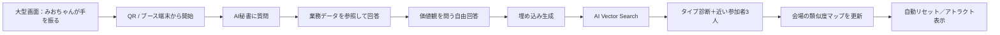
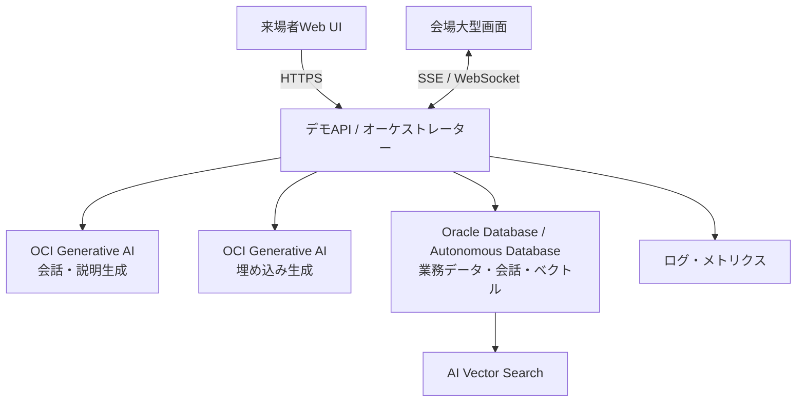

# 「みおちゃん、助けて！」セミナーブースデモ仕様書

| 項目 | 内容 |
|---|---|
| 文書種別 | 初版仕様書（MVP） |
| 対象イベント | SaaS On OCI Forum / ISV Forum、2026年7月15日 |
| デモ形式 | セミナーデモブースでの動態展示 |
| 想定体験時間 | 1人あたり2〜3分 |
| 仮タイトル | **みおちゃん、助けて！ — AI秘書と見つける「あなたに近い人」** |
| ステータス | Slackでの意見を統合した初版。未決事項は「16. 要確認事項」に集約 |

## 1. 目的

来場者が「AI秘書みおちゃん」と会話し、短い質問に回答するだけで、次の価値を楽しく体験できるデモを提供する。

1. OCI Generative AIによる自然な日本語対話
2. Oracle Databaseに格納された業務データのリアルタイム参照
3. 自由回答の埋め込み生成とAI Vector Searchによる類似度検索
4. 参加者同士のつながりを可視化する、会場参加型のゲーム体験

技術説明だけで終わらせず、来場者に「自社データでもすぐ試したい」と思ってもらうことを最終目的とする。

## 2. コンセプトと「Why Oracle」

### 2.1 体験コンセプト

> みおちゃんに相談すると、業務データを踏まえた回答が返り、最後に自分のタイプと「会場で考え方が近い人」が見つかる。

### 2.2 Why Oracleの見せ方

デモ中に、Oracleの各サービスが担っている処理を短いラベルで表示する。裏側を隠しすぎず、「何がOracleで動いたのか」が来場者にも説明員にも分かることを必須とする。

| 来場者に見える価値 | Oracleの役割 | 画面上の表現 |
|---|---|---|
| 自然な会話と要約 | OCI Generative AI | 「OCI Generative AI が回答を生成」 |
| 売上・解約率・顧客情報の即時回答 | Oracle Autonomous Database / Oracle Database | 「Oracle Database から最新データを取得」 |
| 自由回答の意味を数値化 | OCI Generative AIの埋め込みモデル | 「回答をベクトル化」 |
| 似た考えの参加者を瞬時に発見 | Oracle DatabaseのAI Vector Search | 「AI Vector Search で類似度を計算」 |
| 業務データとAIデータを一体管理 | Oracle Database | 結果画面に「業務データ＋ベクトルを同じデータ基盤で活用」 |

本デモで伝える中心メッセージは、**生成AI、構造化された業務データ、ベクトルを分断せず、一つのOracleデータ基盤上で安全に活用できる**こととする。

## 3. 対象ユーザー

- SaaS / ISV企業の経営者、CxO、事業責任者
- 製品企画、開発、データ・AI活用の担当者
- Oracle DatabaseやOCIに詳しくない来場者
- 立ち止まれる時間が2〜3分程度のブース来場者

## 4. 体験全体像

### 4.1 標準シナリオ（約150秒）

| 経過 | 来場者の操作 | みおちゃん／画面の反応 | 技術訴求 |
|---:|---|---|---|
| 0〜15秒 | QRを読み取る、またはブース端末の「はじめる」を押す | `waving.gif`で歓迎。ニックネームと同意を入力 | セッション開始 |
| 15〜60秒 | みおちゃんに1つ質問する | `waiting.gif` → `review.gif`。回答をストリーミング表示 | Generative AI＋Database |
| 60〜90秒 | 価値観を問う質問へ自由回答 | `idle.gif`で入力を促す | 非構造化データ入力 |
| 90〜110秒 | 「診断する」を押す | `running.gif` / `running-left.gif` / `running-right.gif` | 埋め込み生成＋Vector Search |
| 110〜140秒 | 結果を見る | `jumping.gif`。タイプ、近い参加者3人、理由を表示 | 類似検索＋説明生成 |
| 140〜150秒 | QRで結果を持ち帰る、または終了 | `waving.gif`で見送り | CTA表示 |

処理失敗時は`failed.gif`を表示し、事前計算済みのサンプル結果へ切り替えて体験を完走させる。

## 5. デモシナリオ

### 5.1 メイン：AI秘書への質問

来場者はテキストまたは音声で質問する。MVPでは、確実に品質を担保できる以下のサンプル質問を画面に提示する。

- 「今日のスケジュールを確認して」
- 「新幹線が遅延した。次の商談に間に合うように調整案を出して」
- 「今月の売上と解約率を教えて」
- 「A社の顧客状況はどうなっている？」
- 「最近仕事がつらい。優先順位を一緒に整理して」

MVPでは予定変更、予約、メール送信などの外部システム更新は実行しない。サンプルデータを使った**参照・提案のみ**とし、書き込み操作は将来拡張とする。

### 5.2 ゲーム：価値観タイプ診断

来場者ごとの差が出やすく、回答理由も語りやすい自由回答質問を1問出す。初版の推奨質問は次のとおり。

> **あなたが理想とするオフィスを、一言とその理由で教えてください。**

入力例：

- 「静かな個室。午前中に一人で深く集中したいから」
- 「カフェのような空間。部署を越えて偶然会話が生まれてほしいから」
- 「緑と自然光が多い場所。長時間でも気持ちを切り替えやすいから」

別案として、「新入社員なら、入社の決め手にしたい福利厚生は何か」を保持する。イベント来場者との相性、Oracleの伝えたいテーマ、回答の分散度をプロトタイプで比較して最終決定する。

### 5.3 診断結果

結果画面には以下を表示する。

- 「あなたは○○タイプ」というキャッチーなタイプ名
- 2行以内の説明
- 回答のキーワード3つ
- 類似度が高い参加者3人（同意済みのニックネームのみ）
- 各参加者との類似度と、似ている理由
- 会場内の類似度マップ上の現在位置
- 「これはOCI Generative AIで埋め込みを生成し、Oracle DatabaseのAI Vector Searchで検索しています」という技術説明

タイプ名の初期候補：

| タイプ | 傾向 |
|---|---|
| フクロウタイプ | 集中、自律、静けさを重視 |
| イルカタイプ | 柔軟性、社交性、つながりを重視 |
| 小鳥タイプ | 会話、共創、にぎわいを重視 |
| 猫タイプ | 快適性、余白、リラックスを重視 |
| 鷹タイプ | 効率、生産性、機能美を重視 |
| 森の探検家タイプ | 自然、開放感、環境を重視 |

タイプは固定ルールだけで判定せず、回答ベクトルとタイプ説明ベクトルの類似度を基礎にする。LLMは名称と説明の自然な表現にのみ利用し、検索結果そのものを捏造させない。

## 6. 画面仕様

### 6.1 来場者画面（スマートフォン／ブース端末）

| 画面ID | 画面 | 必須要素 |
|---|---|---|
| V-01 | ウェルカム | みおちゃん、タイトル、所要時間、開始ボタン、プライバシー案内 |
| V-02 | 参加設定 | ニックネーム、表示同意、音声利用の選択 |
| V-03 | AI秘書チャット | 会話履歴、入力欄、音声ボタン、サンプル質問、参照中データの表示 |
| V-04 | 価値観質問 | 質問、自由回答欄、文字数、診断ボタン |
| V-05 | 処理中 | みおちゃんのアニメ、現在の処理段階、キャンセル不可の短い案内 |
| V-06 | 診断結果 | タイプ、説明、近い参加者3人、類似度、技術説明、結果共有QR |
| V-07 | エラー | `failed.gif`、再試行、サンプル体験へ切り替えるボタン |

### 6.2 会場大型画面

大型画面は個人のチャット内容を表示せず、次の情報だけをリアルタイム表示する。

- みおちゃんのアニメーション
- 現在の参加人数
- 匿名化した類似度マップ
- タイプ別人数
- 新規参加者が加わった際の短い演出
- Oracleで現在実行した処理を示すテクノロジー・ティッカー
- QRコードと「2分で参加」のCTA

60秒以上操作がない場合は、20〜30秒のアトラクトループを繰り返す。

## 7. アニメーション仕様

提供されたみおちゃんGIFを正式アセットとして使用する。静止画だけに置き換えない。

| ファイル名 | UI状態 | 再生ルール |
|---|---|---|
| `waving.gif` | 歓迎、完了、見送り | 画面入場時に1回、その後は必要に応じてループ |
| `idle.gif` | 入力待ち | 低速ループ |
| `waiting.gif` | LLM応答待ち | 回答の最初のトークンまでループ |
| `review.gif` | データ確認、回答整理 | DB参照中にループ |
| `running.gif` | 埋め込み／検索処理 | 処理中にループ |
| `running-left.gif` | 左方向の画面遷移 | 1サイクル再生後に次画面へ |
| `running-right.gif` | 右方向の画面遷移 | 1サイクル再生後に次画面へ |
| `jumping.gif` | 成功、診断完了 | 結果表示時に2回まで再生 |
| `failed.gif` | エラー | 1回再生後に静止または低速ループ |

実装時の配置先は`/public/assets/miochan/`を想定する。画像の縦横比は維持し、補間は`image-rendering: pixelated`相当を候補とする。点滅や高速ループは避け、`prefers-reduced-motion`が有効な端末では先頭フレームの静止表示に切り替える。

## 8. 機能要件

| ID | 要件 | 優先度 |
|---|---|---|
| FR-01 | QRまたは固定URLからセッションを開始できる | Must |
| FR-02 | ニックネームと公開範囲への同意を取得できる | Must |
| FR-03 | 日本語テキストでみおちゃんと会話できる | Must |
| FR-04 | 音声入力をテキストへ変換できる | Should |
| FR-05 | 許可された業務データをDBから参照して回答できる | Must |
| FR-06 | 回答内で参照したデータ名と更新時刻を示せる | Must |
| FR-07 | 価値観質問の自由回答から埋め込みを生成できる | Must |
| FR-08 | 回答ベクトルをOracle Databaseへ保存できる | Must |
| FR-09 | AI Vector Searchで類似参加者上位3人を検索できる | Must |
| FR-10 | タイプ名、説明、類似理由を表示できる | Must |
| FR-11 | 大型画面の類似度マップをリアルタイム更新できる | Must |
| FR-12 | UI状態に対応して指定GIFを再生できる | Must |
| FR-13 | 一定時間の無操作で個人情報を画面から消し、初期状態へ戻せる | Must |
| FR-14 | AI／DB障害時にサンプル結果へフォールバックできる | Must |
| FR-15 | 展示スタッフがデモデータとセッションをリセットできる | Must |
| FR-16 | 体験完了数、平均応答時間、エラー数を運営画面で確認できる | Should |

## 9. データ仕様

### 9.1 主要テーブル

| テーブル | 主な項目 | 用途 |
|---|---|---|
| `demo_session` | `session_id`, `nickname`, `public_consent`, `status`, `created_at`, `expires_at` | 来場者セッション |
| `chat_message` | `message_id`, `session_id`, `role`, `content`, `source_labels`, `latency_ms`, `created_at` | AI秘書会話 |
| `survey_response` | `response_id`, `session_id`, `question_id`, `answer_text`, `embedding`, `created_at` | 自由回答とベクトル |
| `persona_type` | `persona_id`, `name`, `description`, `reference_embedding` | タイプ定義 |
| `similarity_result` | `session_id`, `matched_session_id`, `score`, `reason`, `created_at` | 類似検索結果 |
| `demo_metric` | `event_name`, `session_id`, `duration_ms`, `success`, `created_at` | 展示運用メトリクス |

ベクトル次元、型、索引定義は採用する埋め込みモデル決定後に確定する。`answer_text`と`embedding`には同一の保持期限を適用する。

### 9.2 サンプル業務データ

- 当日の予定、商談、移動情報
- 月次売上、解約率、MRRの時系列
- 架空の顧客A社の契約、利用状況、ヘルススコア
- FAQおよび運用手順

実在顧客、実在従業員、機密情報は使用しない。数値は一貫性のある架空データとし、回答確認用の期待値を事前に定義する。

## 10. システム構成

### 10.1 処理フロー

1. UIがセッションID付きで質問を送信する。
2. オーケストレーターが許可済みツールだけを使い、必要な業務データをDBから取得する。
3. 取得結果を根拠としてLLMが回答を生成し、UIへストリーミングする。
4. 価値観回答を埋め込みモデルへ送り、ベクトルを生成する。
5. 回答文とベクトルを同一トランザクション境界で保存する。
6. AI Vector Searchで本人を除く上位候補を取得する。
7. スコアと回答要点を根拠に、LLMが短い類似理由を生成する。
8. 匿名化したイベントを大型画面へ配信し、マップを更新する。

## 11. 非機能要件

| ID | 要件 |
|---|---|
| NFR-01 | 初期画面は通常回線で2秒以内を目標に表示する |
| NFR-02 | チャットは2.5秒以内に最初の応答表示、8秒以内に完了を目標とする |
| NFR-03 | 「診断する」から結果表示まで3秒以内を目標とする |
| NFR-04 | 20同時セッションを想定し、展示前に負荷確認する |
| NFR-05 | AIまたはネットワーク障害時も15秒以内にフォールバック結果を表示する |
| NFR-06 | 文字サイズ、コントラスト、キーボード操作、代替テキストを考慮する |
| NFR-07 | すべてのGIFにモーション低減時の静止画フォールバックを持たせる |
| NFR-08 | LLMのプロンプト、DB接続情報、個人回答をブラウザへ露出しない |
| NFR-09 | ブース終了後にセッションデータを一括削除できる |

## 12. セキュリティ・プライバシー

- LinkedInなど外部サービスから参加者情報を収集・スクレイピングしない。
- 来場者が自分で入力した情報だけを利用し、公開前に明示的な同意を取得する。
- 大型画面にはニックネームまたは匿名ID以外の個人情報を表示しない。
- 自由回答に機密情報を入力しないよう、入力欄の近くで案内する。
- DB接続ユーザーはデモ専用かつ最小権限とし、業務データは原則読み取り専用にする。
- LLMから実行できるツールとSQLは許可リスト化し、任意SQLや外部書き込みを許可しない。
- 会話ログと回答の保持期限を設定し、イベント後の削除手順を運営手順書へ記載する。
- プロンプトインジェクションを想定し、システム指示、秘密情報、他セッションの内容を回答しないことをテストする。

## 13. フォールバックと展示運用

### 13.1 障害時の振る舞い

| 障害 | 来場者への表示 | 裏側の処理 |
|---|---|---|
| LLMタイムアウト | `failed.gif`＋「少し混み合っています」 | 1回再試行後、事前生成回答へ切替 |
| DB接続エラー | サンプルデータで続行する旨を表示 | ローカルキャッシュへ切替 |
| 埋め込み／Vector Search失敗 | サンプル診断を表示 | ルールベース診断へ切替 |
| 大型画面配信断 | 来場者画面の体験は継続 | 再接続、復旧後に最新集計を再取得 |
| 音声認識失敗 | テキスト入力を案内 | 音声機能だけ停止 |

### 13.2 当日運営

- 開場前にネットワーク、AI、DB、QR、音声、全GIFをスモークテストする。
- 説明員向けに「30秒説明」「3分説明」「技術詳細」の3種類のトークトラックを用意する。
- デモデータ初期化、サンプル参加者投入、障害モード切替を運営画面から行えるようにする。
- 画面には常に「これは架空のデモデータです」と表示する。

## 14. 受け入れ条件

1. 初見の来場者が説明員の操作補助なしでQRから体験を開始できる。
2. サンプル質問3種類以上で、DB内の期待値と一致する回答が表示される。
3. 自由回答後、埋め込みがDBへ保存され、本人を除く類似参加者3人が返る。
4. 類似度の根拠が、実際の回答キーワードまたは検索結果に基づいて説明される。
5. 結果画面で「OCI Generative AI」「Oracle Database」「AI Vector Search」の役割が確認できる。
6. 指定された9種類のGIFが、表7の状態に対応して再生される。
7. 大型画面に個人のチャット本文や同意のない名前が表示されない。
8. LLM、DB、音声、Vector Searchの各障害を模擬し、体験がフォールバックで完了する。
9. 60秒の無操作後、個人情報が画面から消え、初期状態へ戻る。
10. 20同時セッションの試験で重大エラーがなく、目標応答時間を大きく超えない。

## 15. 実装優先順位とマイルストーン

### MVP

- テキストチャット
- 架空業務データのDB参照
- 自由回答1問
- 埋め込み保存と類似参加者検索
- タイプ診断
- 指定GIFによる状態表現
- 大型画面の簡易マップ
- 障害時サンプルフォールバック

### Stretch

- 音声入力／音声応答
- Property Graphを使った参加者関係の追加可視化
- 複数の危機カードやCxOロールを使う「CxO Quest」モード
- スケジュール変更、予約、メールなどの実システム連携
- 結果カードのSNS共有

### 予定

| 日付 | マイルストーン |
|---|---|
| 2026年7月3日（金） | 内容・質問・タイプ名・製品表記を確定 |
| 2026年7月6日（月） | MVP構築開始 |
| 2026年7月7日（火） | 部会向けプロトタイプ提出 |
| 2026年7月8〜10日 | UI、回答品質、類似検索、展示モードを調整 |
| 2026年7月13〜14日 | 通しリハーサル、負荷・障害テスト、運営手順確定 |
| 2026年7月15日（水） | 本番展示 |

## 16. 要確認事項

以下は初版時点で未決定。プロトタイプ開始前にオーナーと決定期限を設定する。

1. 製品の正式表記を「Oracle AI Database 26ai」「Oracle Database 26ai」「Autonomous Database」のどれに統一するか。
2. 来場者へ出す価値観質問を「理想のオフィス」と「福利厚生」のどちらにするか。
3. キャラクター名を「みおちゃん」で確定するか。
4. Slack添付GIFの展示・二次利用範囲、背景透過、解像度、ループ速度に問題がないか。
5. 音声入力をMVP必須にするか。
6. 大型画面にニックネームを表示するか、完全匿名にするか。
7. 類似度スコアを数値で見せるか、「とても近い／近い」などの段階表示にするか。
8. 会場で想定する同時参加者数と、事前投入するサンプル参加者数。
9. データ保持期間とイベント後の削除責任者。
10. 結果持ち帰り用QRのリンク先とCTA。

## 17. 企画検討事項

- AIデモセッションの方向性とレスキューゲーム案
- みおちゃんのキャラクターおよびGIF一式
- 質問回答をメインにしたゲーム的アンケート
- 自由回答の埋め込みと類似度マップ
